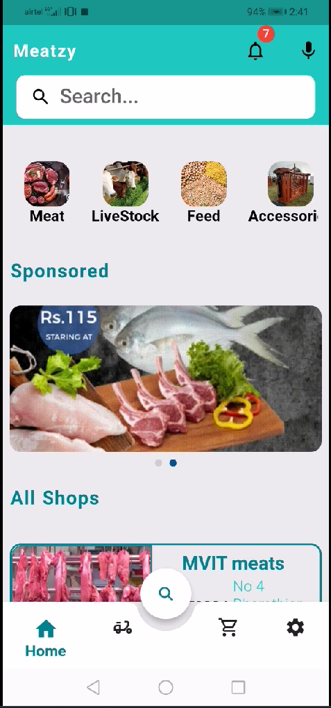
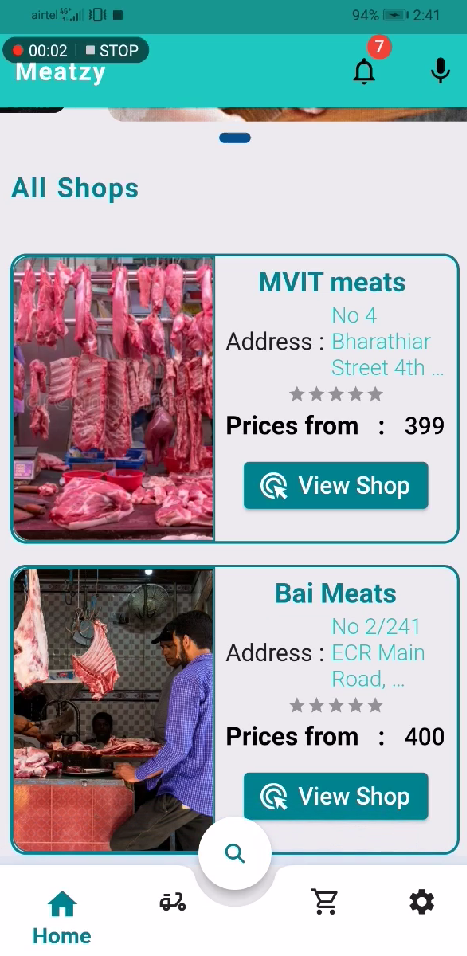
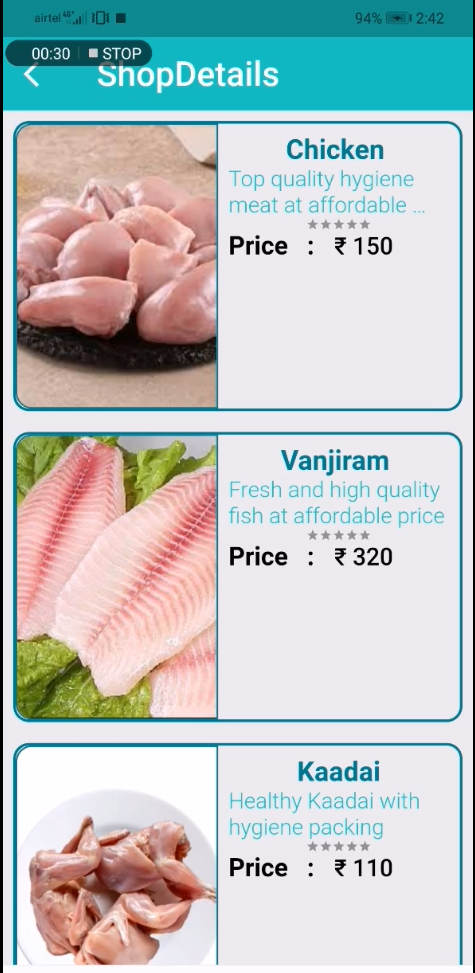
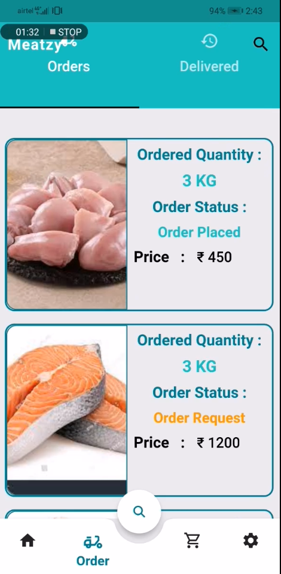
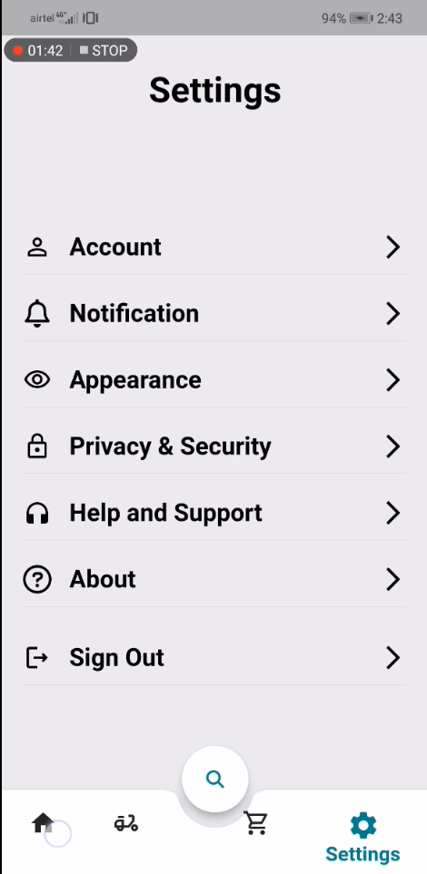

# Meatzy

## Description
Meatzy is a comprehensive meat and livestock buying platform developed using Flutter and Firebase. It provides users with a seamless shopping experience for meat and livestock products. The app includes features such as push notifications, Google Sign-In, Phone Sign-In powered by Firebase Auth, cart management, order tracking, and more.

## Features
- Browse and purchase a wide variety of meat and livestock products.
- User authentication with Firebase Auth (Google Sign-In, Phone Sign-In).
- Push notifications to keep users updated on their orders.
- Add products to cart and manage cart items.
- View order history and track order status.

## Technologies Used
- Flutter
- Dart
- Firebase (Firestore, Authentication, Cloud Messaging)

## Installation Instructions

1. **Clone the repository**:
   ```sh
   git clone https://github.com/Althaf-codes/meatzy.git
   cd meatzy

2. Install Flutter dependencies:
   ```sh
   flutter pub get

3. Set up Firebase:
   Follow the instructions from Firebase docs to add Firebase to your Flutter app:

4. Run the app:
   ```sh
   flutter run

## Screenshots








## Created Date
This project was created on June 6, 2022 during college day's startup aura.
